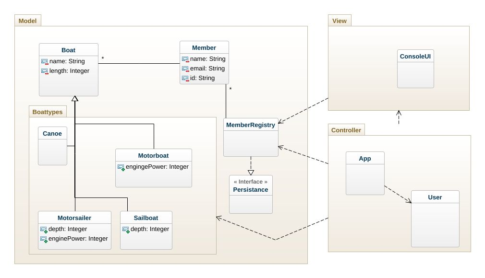

# Assigment 4
A large protion of this project was copeid from another repository. Therefore there are some attributes and methods that do withing this environment hold no purpose. I decided to still leave them in the code as they could prove useful if the app should ever be expanded.

There is currently no functionality for browsing more than the top 10 users, an unfortunate side effect of allowing both numbers and characters in the input. Given more time, this would be restructured.

The functionality of deleting a boat is also not currently implemented.

Some of the code handling the reading and writing data to file is maybe more hard-coded than needed and could be re-written in a more oo-firendly way.

## Class diagram
